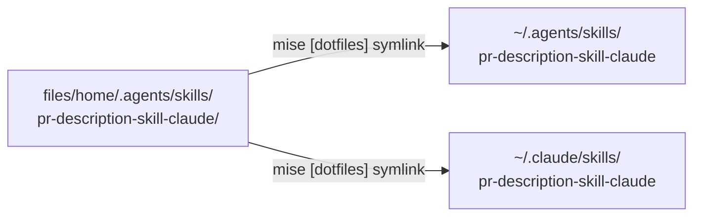

# PR description skill for Claude

Status: implemented. Approved on 2026-10-02.

## Proposed change

Port the upstream
[`pr-description-skill`](https://github.com/githubnext/apm/tree/6aceef72be49/.agents/skills/pr-description-skill)
(MIT) into this repository as a global skill named
`pr-description-skill-claude`. Remove everything specific to `apm`. Write
it with the `writing-for-agents` reference.



Target layout:

```
files/home/.agents/skills/pr-description-skill-claude/
├── SKILL.md                         steps + output contract (~120 lines)
├── NOTICE.md                        MIT credit, upstream commit 6aceef72be49
├── assets/
│   ├── pr-body-template.md          loaded at drafting time
│   ├── section-rubric.md            loaded at self-check time
│   ├── scenario-evidence-rubric.md  loaded for behavior-change PRs
│   └── mermaid-conventions.md       loaded before drafting a diagram
└── scripts/
    └── validate-mermaid.sh          extracts and checks every mermaid block
```

### Keep from upstream

- Section order: TL;DR, Problem (WHY), Approach (WHAT), Implementation
  (HOW), Diagrams, Trade-offs, Validation, How to test.
- Length ceilings and `<details>` for long evidence.
- GitHub Markdown features: alerts, collapsibles, task lists.
- Required `mmdc` validation of every mermaid block.
- The GitHub-renderer gotcha list in `mermaid-conventions.md`.
- Anti-patterns: marketing tone, restating the diff, pasting commit
  messages, unvalidated diagrams.
- Output to one file (default `.git/PR_BODY.md`). The skill does not run
  `gh pr create`.

### Change from upstream

| Upstream | Port |
|---|---|
| Charset section: ASCII for the skill's own files (cp1252 terminals), UTF-8 GFM for output | Removed. Output stays UTF-8 GFM; this repo has no ASCII rule. |
| Claims must quote PROSE or Agent Skills | Cite-or-omit with any credible evidence: issue, log, `file:line`, doc URL, prior PR. |
| APM principle taxonomy | Repo principles from README, CONTRIBUTING, or AGENTS.md; else a short generic list; else drop the column. |
| `apm audit --ci`, `uv run pytest`, `.apm/...` lint file | Discover lint and test commands from mise tasks, `hk.pkl`, Makefile, `package.json`, CI workflows, AGENTS.md. |
| `microsoft/apm` permalinks | `gh repo view --json nameWithOwner` plus head SHA. |
| `Co-authored-by: Copilot` trailer | Removed. |
| Orchestrator activation contract | The agent gathers its own inputs. It asks only when the motivation is missing. |
| Title verbs {add, harden, ship, ...}, 100 chars | Conventional Commits title. |
| 150-220 lines, all sections always | Length scales with the diff. Benefits merges into TL;DR. Trade-offs is optional for mechanical PRs. |
| `evals/` and `run_evals.py` | Removed. The keyword matcher scores hand-written fixtures, not real output. |

### Add

- Use `.github/pull_request_template.md` (or its variants) as the
  structure when the repo has one.
- When a `doc{s}/plans/*.md` file belongs to the branch, append it in a
  collapsed `<details>` titled "Implementation Plan", per the global
  agent instructions.
- `validate-mermaid.sh` uses `mktemp -d` and the global `mmdc` from
  `npm:@mermaid-js/mermaid-cli`. It exits non-zero and names the block on
  the first failure.

## Reasoning

- Model-invoked skill: the agent must fire it on "write a PR
  description" and "open a PR". The description stays short: what it
  produces plus one trigger per branch.
- Progressive disclosure: `SKILL.md` carries the steps every PR needs.
  The template, rubrics, and mermaid conventions load only when a step
  reaches them. Scenario evidence loads only for behavior-change PRs.
- A script replaces the inline awk so `shellcheck` and `shfmt` in
  `hk.pkl` cover it, and so the temp directory is not a fixed path.
- Two symlinks, one source: `~/.agents/skills` serves Codex and other
  agents. `~/.claude/skills` serves Claude Code, which does not read
  `~/.agents/skills`.
- No new dependency: `mmdc` is already a global mise tool.

## Tasks

- [x] Create `files/home/.agents/skills/pr-description-skill-claude/`
      with `SKILL.md`, `NOTICE.md`, and the four assets.
- [x] Add `scripts/validate-mermaid.sh`; pass `shellcheck` and `shfmt`.
- [x] Add two `[dotfiles]` symlink entries in
      `files/home/.config/mise/config.toml`.
- [x] Run `mise run lint`.
- [x] Apply the symlinks with mise; confirm both paths resolve.
- [x] Confirm Claude Code lists the skill in a new session.
- [x] Dry run: draft a PR body for this branch; validate its mermaid
      blocks with the script.
- [x] Clarify skill wording from dry-run findings: scenario skip case,
      visible-length counting, safe test commands, unpushed permalinks,
      evidence for external claims, plan staleness.
- [ ] Commit on a feature branch; open a PR only on request.
