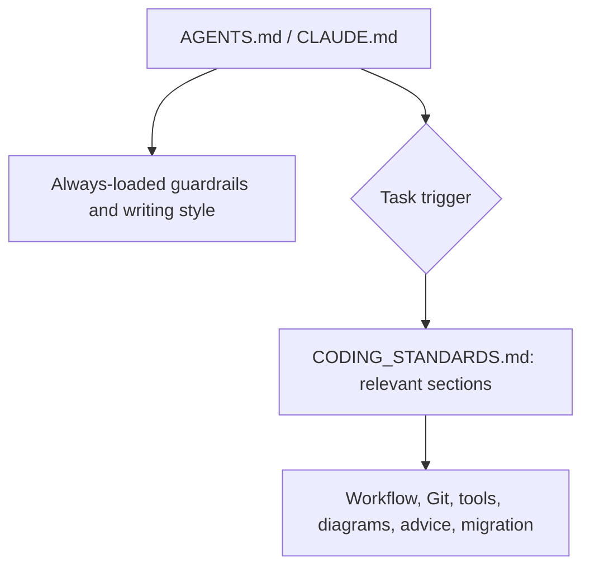

# Restructure user-level agent instructions

Status: Approved by the user on 2026-10-07. Implemented in PR #25.

## Goal

Reduce always-loaded instructions in `files/home/.codex/AGENTS.md`.
Keep explicit user preferences. Move task-specific rules to one
`CODING_STANDARDS.md` reference. Create one PR after approval.



## Three subagent proposals

Each subagent read the original instructions and the writing-for-agents
skill. Each produced an independent candidate without editing files.

| Pass | Restructuring | Pruning | Tradeoff |
| --- | --- | --- | --- |
| 1. Conservative | Keep safety, discovery, clarification, writing, advice, and migration instructions inline. Move development details to one reference. | Remove duplicate wording and unneeded rationale. | Least behavior risk; more always-loaded text. |
| 2. Moderate | Keep safety and plan approval inline. Route changes, Git, writing, advice, and migrations to reference sections. | Consider removing runtime defaults for discovery and user input. | Better disclosure; removed defaults may differ across agents. |
| 3. Radical | Keep only safety and writing style inline. Route all repository workflow, discovery, Git, tools, diagrams, advice, and migrations. | Remove precedence and user-input repetition. | Smallest entry point; discovery and approval depend on pointer activation. |

## Recommendation

Use the moderate structure with two safeguards from the conservative pass:
keep ancestor discovery and material-decision guidance inline. Keep plain
writing inline, as the radical pass suggests. Keep plan approval inline.

The source also serves Claude through `~/.claude/CLAUDE.md`. Treat rules
that overlap with this Codex session as runtime-specific no-op candidates,
not universal defaults. Preserve their useful behavior across consumers.

Use one standards document. Add deployment mappings for both consumers.
The current mapping deploys only the instruction file, not its directory.
Both installed sibling links must resolve to the same standards source.

### Proposed AGENTS.md

```markdown
# Working agreements

- Ask before adding production dependencies.
- Keep infrastructure tools and APIs read-only. Never mutate or destroy
  infrastructure. Respect API rate limits.
- Merge a PR only with my approval.
- Before implementing a significant change, write a plan and get approval.
- At session start, read every `AGENTS.md` from the working directory
  through the filesystem root.
- Use `request_user_input`, when available, for material decisions that
  repository context does not resolve. Proceed on low-risk choices.
- Write short sentences. Use active voice, one idea per sentence, and
  consistent terms.

## Task references

Read the relevant sections of [CODING_STANDARDS.md](CODING_STANDARDS.md)
before the corresponding work:

- Significant changes or handoffs: Change workflow.
- Commits, PRs, or worktrees: Git.
- Shell scripts, GitHub, GitHub Actions, or mise: Tools.
- Architecture, flow, state, sequence, or dependency explanations: Diagrams.
- Agile, XP, or consulting guidance: Consulting.
- Migrations: Migration wizard.
```

### Proposed CODING_STANDARDS.md

```markdown
# Coding standards

## Change workflow

Before implementing a significant change:

1. Create `YYYYMMDD-<kebab-case-topic>.md` in the project's existing
   `docs/plans/` or `doc/plans/` directory. If neither exists, create
   `docs/plans/`. Use the local date. Preserve existing files.
2. Describe the proposed changes, their reasons, and a task checklist.
3. Present the plan for review. Wait for approval before implementation.
4. Update the plan and checklist as work progresses.

When asking permission only to write the plan, use:
“Execute writing of plan to markdown at <path>?”
That permission covers writing the document. It does not approve its contents.

Save handoffs in the project's existing `docs/handoffs/` or `doc/handoffs/`.
If neither exists, create `docs/handoffs/`. Use
`YYYYMMDD-<kebab-case-topic>.md`, the local date, and preserve existing files.

## Git

Use Conventional Commits 1.0.0. Limit titles to 50 characters and wrap
bodies at 72 characters. Explain what changed and why in the body.

For an approved PR merge, include the PR number in the commit title:
`feat(topic): descriptive (#7)`.

For a planned change, end the PR description with a collapsed `<details>`
section titled `Implementation Plan`. Include the approved plan and current
checklist. Keep the main description concise. Update the section as work
progresses. If the plan file was deleted from Git, recover its latest
contents from Git history for that section.

You may create worktrees under `~/src/worktrees/<repo>/YYYYMMDD-<topic>`.
Report the exact path when creating one.

## Tools

Use these tools when available:

- Shell scripts: `shellcheck`.
- GitHub: `gh`.
- GitHub Actions: `actionlint`.
- mise: consult https://mise.jdx.dev/ for current documentation. For
  advanced examples, consult https://github.com/jdx/mise,
  https://github.com/jdx/fnox, and https://github.com/jdx/hk.

## Diagrams

Lead explanations of architecture, data or control flow, state, sequence,
or dependencies with a diagram. Use ASCII in terminals and Mermaid in
Markdown files and PRs. Add prose for what the diagram cannot show.

## Consulting

For Agile, XP, or consulting guidance, use the
[Pivotal Alumni Codex](https://github.com/alumni-codex/alumni-codex.github.io)
as a resource.

## Migration wizard

When a migration comes up, use `request_user_input`, when available, to offer:

- Create a wizard for manual steps.
- Continue without a wizard.

Honor a choice already made in the conversation. For a wizard, read and
follow `$wizard`. Include only steps the human must perform.
```

## Rule disposition

| Original rule | Proposed disposition |
| --- | --- |
| Production dependency approval | Keep inline |
| Infrastructure restriction and rate limits | Keep inline; remove command examples |
| PR merge approval | Keep inline |
| Commit format, lengths, and body purpose | Move to Git |
| Merge title includes PR number | Move to Git; clarify approved merge |
| Worktree permission, location, and report | Move to Git; retain permission wording |
| Pivotal Alumni Codex | Move to Consulting |
| Tool preferences and current mise docs | Move to Tools |
| Plain explanations | Keep concrete requirements inline; remove vague 80% qualifier |
| Diagram-first explanations | Move to Diagrams |
| Plan approval | Keep inline; process in Change workflow |
| Plan creation, content, updates, permission wording | Move to Change workflow |
| Handoff paths and preservation | Move to Change workflow |
| PR plan details and history recovery | Move to Git |
| Ancestor discovery | Keep inline for portability |
| Instruction precedence | Remove runtime hierarchy restatement |
| Material decisions and low-risk autonomy | Keep inline for portability |
| Question count and options | Remove tool-contract repetition |
| Migration choices and wizard | Move to Migration wizard |

The removed examples and vague qualifiers are editorial pruning, not
proven behavioral no-ops. Precedence and question-count wording duplicate
runtime contracts in this session. No behavioral experiment has established
universal no-op status across agent products.

Fix `YYYMMDD` to `YYYYMMDD`. Resolve `doc{s}` by using an existing convention
and choosing `docs/` only when neither directory exists. These are explicit
clarifications, not hidden preference removals.

## Scope and verification

- Change only the user-level instruction source, its new sibling reference,
  the two standards deployment mappings, and this plan.
- Map `~/.codex/CODING_STANDARDS.md` and `~/.claude/CODING_STANDARDS.md` to
  `~/.dotfiles/files/home/.codex/CODING_STANDARDS.md`.
- Verify source and installed-path link layout in a disposable directory.
  Do not apply dotfiles to the live home directory.
- Review every original rule against the disposition table.
- Check task routing for implementation, review, commit, PR, worktree,
  handoff, shell, GitHub, Actions, mise, explanation, advice, and migration.
  This checks coverage; it does not prove model behavior.
- Run `git diff --check` and the repository's `mise run lint` checks.
- Create one branch and one PR. Include the approved plan and updated
  checklist in its collapsed Implementation Plan section. Leave merging
  for explicit user approval.

## Checklist

- [x] Read applicable instructions, skill, source, and deployment config.
- [x] Obtain three progressively more radical subagent proposals.
- [x] Compare rule disposition and deployment risks.
- [x] Write concrete recommended drafts for review.
- [x] Obtain approval of this plan.
- [x] Restructure AGENTS.md and add CODING_STANDARDS.md.
- [x] Add both standards deployment mappings.
- [x] Check rule coverage, pointer layout, and repository lint.
- [x] Create one PR with the approved plan and current checklist.

## Validation results

- `mise run lint`: all six checks passed.
- `git diff --check`: passed.
- Both sibling references resolve in a disposable home layout.
- All six task routes match the standards headings.
- Final instruction files match the approved drafts exactly.
- All original rules are accounted for in the disposition table.
- AGENTS.md decreased from 60 to 25 lines and from 638 to 147 words.
- Live dotfiles deployment was not run.
