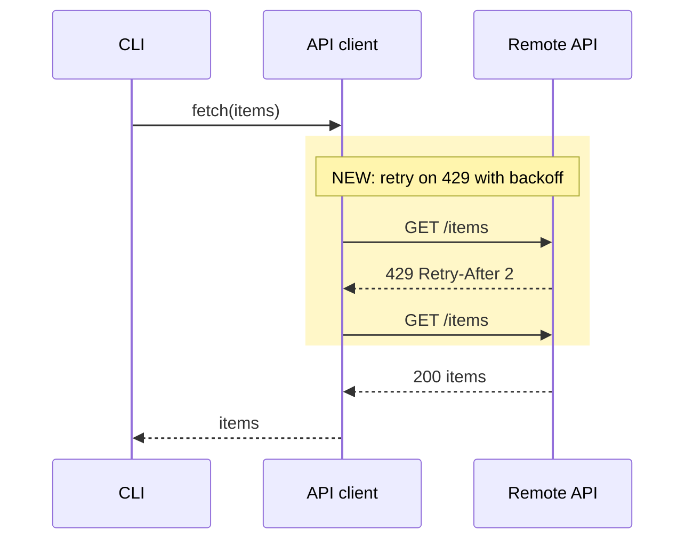
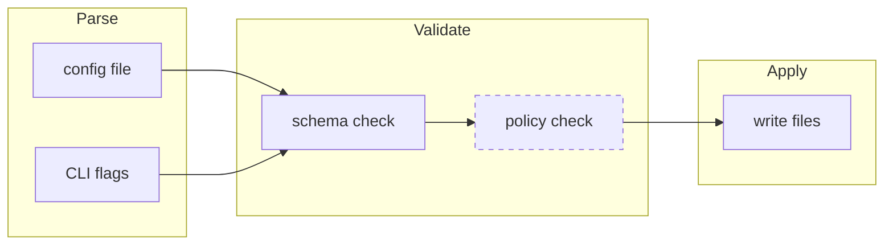
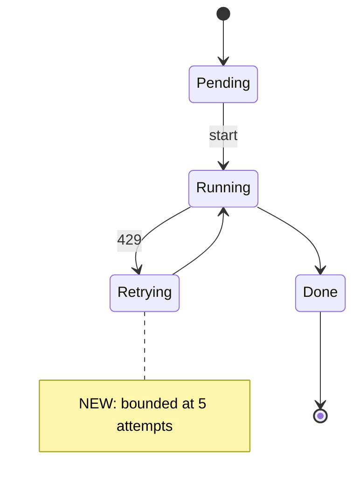

# Mermaid conventions for PR bodies

A PR diagram answers one reviewer question. Pick the type from the
question, mark what this PR adds when the diagram also shows existing
parts, and keep it under about 25 nodes; split a larger diagram in two.

## Type by question

| Reviewer question | Type | Mark new behavior with |
|---|---|---|
| Who calls whom, in what order? | `sequenceDiagram` | `rect rgb(255, 247, 200)` around new messages |
| What stages does data pass through? | `flowchart LR`, one `subgraph` per stage | `classDef new stroke-dasharray: 5 5` |
| How do components or files depend on each other? | `flowchart LR` | `classDef new stroke-dasharray: 5 5` |
| What states can a thing be in? | `stateDiagram-v2` | multi-line `note right of` |
| Which types extend or contain which? (rare) | `classDiagram` | standalone `class Name:::new` lines |

Interaction between distinct actors over time (services, jobs, processes)
is a `sequenceDiagram`; a flowchart of it hides the time axis.

## Templates

### sequenceDiagram

- Each participant is a distinct actor. Work inside one actor is a
  self-message: `A->>A: parse`.
- `->>` sends; `-->>` returns.
- `Note over` states an invariant, not narration.

### flowchart LR

- Assign classes on a separate `class N new;` line.
- Label an edge only when the verb is non-obvious.
- Use `TD` only for trees.

### stateDiagram-v2

`note right of X` needs the multi-line form with `end note` on its own
line.

## Syntax that renders on GitHub

`mmdc` and GitHub can run different Mermaid versions, so a block that
passes `mmdc` can still fail on GitHub. Write these forms:

| Write | Instead of |
|---|---|
| `A -->\|"[EXEC] do work"\| B` (quote edge labels with `[]`, `()`, `:`, `/`, or `\|`) | `A -->\|[EXEC] do work\| B` |
| `A["foo (bar)"]` | `A[foo (bar)]` |
| `A["a &lt; b"]`, `A["say &quot;hi&quot;"]` | raw `<`, `>`, `"` inside a label |
| `A --> B : parses, validates` in `classDiagram` | a `;` inside the link label |
| `class B:::touched` on its own line in `classDiagram` | `A *-- B:::touched` |

After the PR is opened, check that every block renders. GitHub shows a
failed block as raw code; fix it with `gh pr edit --body-file`.
