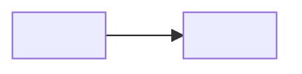

# PR body

Fill this file from the facts gathered in `SKILL.md`. Delete every angle-bracket hint. Omit the Diagrams section when the change does not alter control flow and does not cross components.

## TL;DR

<What changed, and why now.>

> [!NOTE]
> <Optional. One sentence for a linked issue, or the single fact a reviewer needs first. Delete this alert when you have neither.>

## Problem

<Tag a bullet `[x]` for an observed failure or `[!]` for a softer risk. Put a verbatim quote in a link to an issue, a log, a test, or a doc in this repository. Delete a claim you cannot tie to a source.>

- [x] <Observed failure, with the file or command that shows it.>
- [!] <Softer risk observed in the diff.>

## Approach

<A table or a bullet list. When the change only adds behavior, replace this body with `Additive. See Implementation.`>

| # | Change |
| --- | --- |
| 1 | <One line. What changed, and why, when the why is not obvious.> |

## Implementation

<One short paragraph per file, or a table when the file list is long. State the intent. State what you left alone when that choice matters. On GitHub, link the line range.>

- **`<path>`** <Intent in one or two sentences.>

## Diagrams

<One sentence of legend before each block. Nodes and edges use real names from the diff. Follow the edge-label rule in `SKILL.md` step 5.>

<Legend sentence.>



## Trade-offs

<Name the option chosen and the option rejected. When you skip the scenario table, name the skip here.>

- **<Decision.>** Chose <option>. Rejected <option> because <reason tied to a fact from this PR>.

## Validation

<The command name on its own line, then a fence with the real output. Put a long transcript in `<details>`.>

`<task command>`:

```
<verbatim output>
```

### Scenario evidence

<Required for a behavior change. One row per user-facing scenario. The scenario is in the user's words. The test is a real path, with `::test_name` or a line range when the file has one. The type is `unit`, `integration`, or `e2e`.>

| # | Scenario | Test | Type |
| --- | --- | --- | --- |
| 1 | <What the user can now do, or what failure stays fixed.> | `<path>::<test>` | unit |

## How to test

<Each step is an action and an expected result.>

- [ ] <Action.> <Expected result.>
